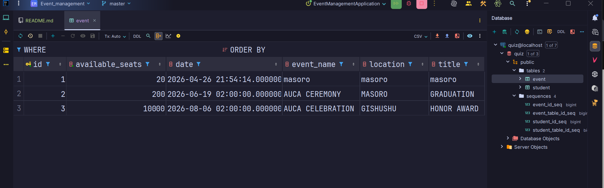
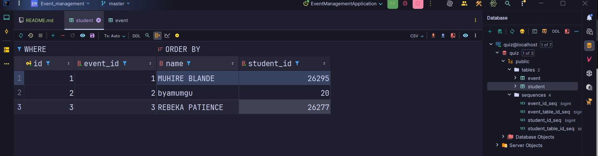

# Event Management System
                             #AUTHORS:
              MUHIRE BLANDE 26295
              REBEKA PATIENCE

## Table of Contents
- [Project Overview](#project-overview)
- [System Architecture](#system-architecture)
- [Technology Stack](#technology-stack)
- [Features](#features)
- [Project Structure](#project-structure)
- [Database Schema](#database-schema)
- [API Documentation](#api-documentation)
- [Setup and Installation](#setup-and-installation)
- [Running the Application](#running-the-application)
- [User Guide](#user-guide)
- [Screenshots](#screenshots)
- [Troubleshooting](#troubleshooting)
- [Future Enhancements](#future-enhancements)

---

## Project Overview

The Event Management System is a full-stack web application designed to manage events and student registrations. It provides two main portals:

- **Admin Portal**: Create and manage events, view student registrations
- **Student Portal**: Browse available events and register for events

The system is built using Spring Boot 4.0.6 for the backend and Vue.js 3 for the frontend, with PostgreSQL as the database.

---

## System Architecture

```
┌─────────────────────────────────────────┐
│          Frontend (Vue.js 3)            │
│  ┌──────────────┬──────────────────┐    │
│  │ AdminView    │  StudentView     │    │
│  │ (Event Mgmt) │  (Registration)  │    │
│  └──────────────┴──────────────────┘    │
│           Pinia State Store              │
│           Axios HTTP Client              │
└─────────────────┬───────────────────────┘
                  │ HTTP/REST API
┌─────────────────▼───────────────────────┐
│       Backend (Spring Boot 4.0.6)       │
│  ┌──────────────┬──────────────────┐    │
│  │Controllers   │   Services       │    │
│  │  - Event     │  - EventService  │    │
│  │  - Student   │  - StudentSvc    │    │
│  └──────────────┴──────────────────┘    │
│           JPA Repositories               │
└─────────────────┬───────────────────────┘
                  │
┌─────────────────▼───────────────────────┐
│       Database (PostgreSQL)             │
│  - Event Table                          │
│  - Student Table                        │
└─────────────────────────────────────────┘
```

---

## Technology Stack

### Backend
- **Framework**: Spring Boot 4.0.6
- **Language**: Java 21
- **Build Tool**: Maven
- **Database**: PostgreSQL
- **ORM**: Spring Data JPA / Hibernate
- **API Documentation**: SpringDoc OpenAPI 3.0.2
- **Utilities**: Lombok
- **Monitoring**: Spring Boot Actuator

### Frontend
- **Framework**: Vue.js 3.5.32
- **State Management**: Pinia 3.0.4
- **Routing**: Vue Router 5.0.6
- **HTTP Client**: Axios 1.15.2
- **Build Tool**: Vite 8.0.10

---

## Features

### Admin Features
- ✅ Create new events with details (name, title, location, date, capacity)
- ✅ View all active events
- ✅ Track student registrations per event
- ✅ View registered student details (name, ID)
- ✅ Real-time registration count

### Student Features
- ✅ Browse upcoming events
- ✅ View event details (name, description, location, date, available seats)
- ✅ Register for events with name and student ID
- ✅ View registered events (by student ID lookup)

---

## Project Structure

```
Event_management/
├── src/
│   ├── main/
│   │   ├── java/com/blacc/event_management/
│   │   │   ├── EventManagementApplication.java    # Main application entry
│   │   │   ├── controller/
│   │   │   │   ├── EventController.java           # REST endpoints for events
│   │   │   │   └── StudentController.java         # REST endpoints for students
│   │   │   ├── model/
│   │   │   │   ├── Event.java                     # Event entity
│   │   │   │   └── Student.java                   # Student entity
│   │   │   ├── repository/
│   │   │   │   ├── EventRepositry.java            # Event JPA repository
│   │   │   │   └── StudentRepository.java         # Student JPA repository
│   │   │   └── service/
│   │   │       ├── EventService.java              # Event business logic
│   │   │       └── StudentService.java            # Student business logic
│   │   └── resources/
│   │       └── application.properties             # Application configuration
│   └── test/
│       └── java/com/blacc/event_management/
│           └── EventManagementApplicationTests.java
├── frontend/
│   ├── src/
│   │   ├── views/
│   │   │   ├── AdminView.vue                      # Admin portal UI
│   │   │   └── StudentView.vue                    # Student portal UI
│   │   ├── stores/
│   │   │   └── eventStore.js                      # Pinia state management
│   │   ├── router/
│   │   │   └── index.js                           # Vue Router configuration
│   │   ├── App.vue                                # Root component
│   │   ├── main.js                                # Frontend entry point
│   │   └── style.css                              # Global styles
│   ├── package.json
│   └── vite.config.js
├── pom.xml                                        # Maven dependencies
└── README.md                                      # Project documentation
```

---

## Database Schema

### Event Table
| Column          | Type      | Constraints              | Description                |
|----------------|-----------|--------------------------|----------------------------|
| id             | BIGINT    | PRIMARY KEY, AUTO_INCREMENT | Unique event identifier  |
| event_name     | VARCHAR   | NOT NULL                 | Name of the event          |
| title          | VARCHAR   | NOT NULL                 | Event description/title    |
| location       | VARCHAR   | NOT NULL                 | Event location             |
| date           | DATE      | NOT NULL                 | Event date (yyyy-MM-dd)    |
| available_seats| INTEGER   | NOT NULL                 | Total capacity/seats       |

### Student Table
| Column     | Type   | Constraints              | Description                    |
|-----------|--------|--------------------------|--------------------------------|
| id        | BIGINT | PRIMARY KEY, AUTO_INCREMENT | Unique registration ID      |
| name      | VARCHAR| NOT NULL                 | Student's full name            |
| student_id| BIGINT | NOT NULL                 | Student's unique ID number     |
| event_id  | BIGINT | NOT NULL, FOREIGN KEY    | Reference to registered event  |

**Note**: Database is configured as `quiz` on PostgreSQL (localhost:5432). Auto-creates tables with `spring.jpa.hibernate.ddl-auto=update`.

---

## API Documentation

### Base URL
```
http://localhost:8080/api
```

### Endpoints

#### Event Endpoints

**1. Get All Events**
```http
GET /api/events
```
- **Description**: Retrieve all events
- **Response**: `200 OK` - Array of Event objects
- **Example Response**:
```json
[
  {
    "id": 1,
    "eventName": "Tech Talk 2026",
    "title": "AI & Future",
    "location": "Main Hall",
    "date": "2026-05-15",
    "availableSeats": 100
  }
]
```

**2. Create Event**
```http
POST /api/events
Content-Type: application/json
```
- **Description**: Create a new event
- **Request Body**:
```json
{
  "eventName": "Tech Talk 2026",
  "title": "AI & Future",
  "location": "Main Hall",
  "date": "2026-05-15",
  "availableSeats": 100
}
```
- **Response**: `200 OK` - Created Event object
- **CORS**: Enabled for all origins

#### Student Endpoints

**1. Get All Students**
```http
GET /api/students
```
- **Description**: Retrieve all student registrations
- **Response**: `200 OK` - Array of Student objects
- **Example Response**:
```json
[
  {
    "id": 1,
    "name": "John Doe",
    "studentId": 12345,
    "eventId": 1
  }
]
```

**2. Register Student**
```http
POST /api/students
Content-Type: application/json
```
- **Description**: Register a student for an event
- **Request Body**:
```json
{
  "name": "John Doe",
  "studentId": 12345,
  "eventId": 1
}
```
- **Response**: `200 OK` - Created Student object
- **CORS**: Enabled for all origins

### OpenAPI Documentation
SpringDoc OpenAPI UI is available at:
```
http://localhost:8080/swagger-ui.html
```

---

## Setup and Installation

### Prerequisites
- **Java 21** or higher
- **Maven 3.6+**
- **Node.js 18+** and npm
- **PostgreSQL 12+** running on localhost:5432

### Step 1: Database Setup

1. Install PostgreSQL if not already installed
2. Create the database:
```sql
CREATE DATABASE quiz;
```
3. Update database credentials in `src/main/resources/application.properties`:
```properties
spring.datasource.url=jdbc:postgresql://localhost:5432/quiz
spring.datasource.username=postgres
spring.datasource.password=123
```

### Step 2: Backend Setup

1. Navigate to the project root directory:
```bash
cd Event_management
```

2. Build the project:
```bash
mvn clean install
```

3. (Optional) Run tests:
```bash
mvn test
```

### Step 3: Frontend Setup

1. Navigate to the frontend directory:
```bash
cd frontend
```

2. Install dependencies:
```bash
npm install
```

---

## Running the Application

### Option 1: Run Backend and Frontend Separately (Development)

**Start Backend:**
```bash
# From project root
mvn spring-boot:run
```
The backend will start on `http://localhost:8080`

**Start Frontend:**
```bash
# From frontend directory
npm run dev
```
The frontend will start on `http://localhost:5173` (or another available port)

### Option 2: Run as JAR (Production)

1. Build the JAR:
```bash
mvn clean package -DskipTests
```

2. Run the JAR:
```bash
java -jar target/Event_management-0.0.1-SNAPSHOT.jar
```

3. Build and serve frontend separately:
```bash
cd frontend
npm run build
# Deploy the 'dist' folder to your web server
```

---

## User Guide

### Admin Portal

1. **Access Admin Console**: Navigate to `/admin` or click "Admin" in the navigation bar. This is where the Events are Added and number of Student's registrations per event are registered. Real-time updates are also shown.

2. **Create a New Event**:
   - Fill in the event details form:
     - **Event Name**: e.g., "Tech Talk 2026"
     - **Title/Description**: e.g., "AI & Future"
     - **Location**: e.g., "Main Hall"
     - **Date**: Select date from calendar
     - **Capacity**: Number of available seats
   - Click "Publish Event"
   - Success message will appear

3. **View Events and Registrations**:
   - All active events are displayed on the right panel
   - Each event shows:
     - Event name and description
     - Number of registrations
     - List of registered students (name and ID)
   - Events update in real-time

### Student Portal

1. **Access Student Portal**: Navigate to `/student` or click "Student" in the navigation bar. This is where Students register there events and view upcoming events.

2. **Register for an Event**:
   - Fill in the registration form:
     - **Full Name**: Your complete name
     - **Student ID**: Your unique student ID number
     - **Select Event**: Choose from dropdown
   - Click "Confirm Registration"
   - Success message will appear

3. **Browse Upcoming Events**:
   - Scroll down to see all available events
   - Each event card shows:
     - Event name and description
     - Location badge
     - Event date
     - Available seats count

---

## Screenshots


### Admin Portal


### Student Portal


### API Documentation


### Database


---

---

## Development Team

**Project**: Event Management System  
**Backend**: Spring Boot 4.0.6  
**Frontend**: Vue.js 3.5.32  
**Database**: PostgreSQL  

---

