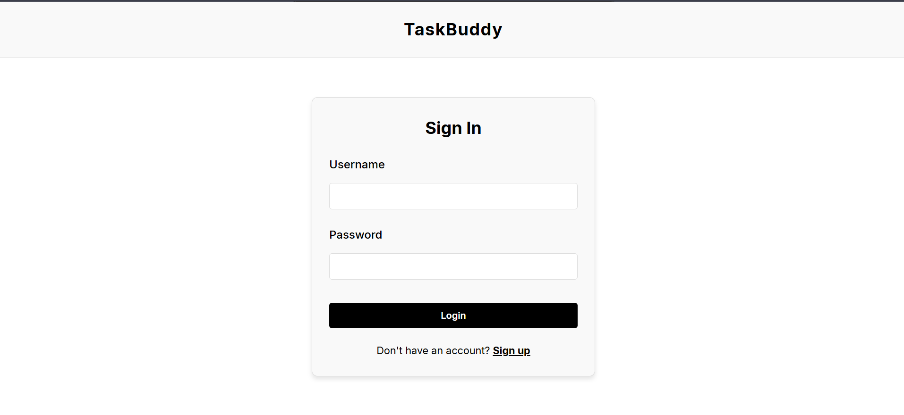
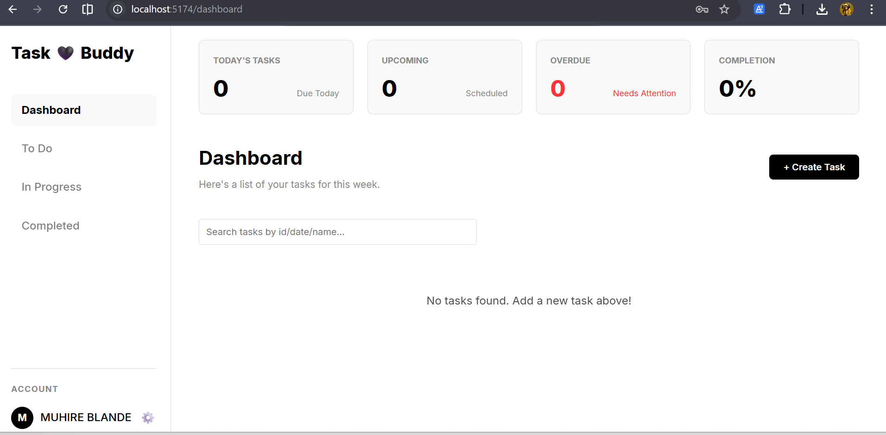
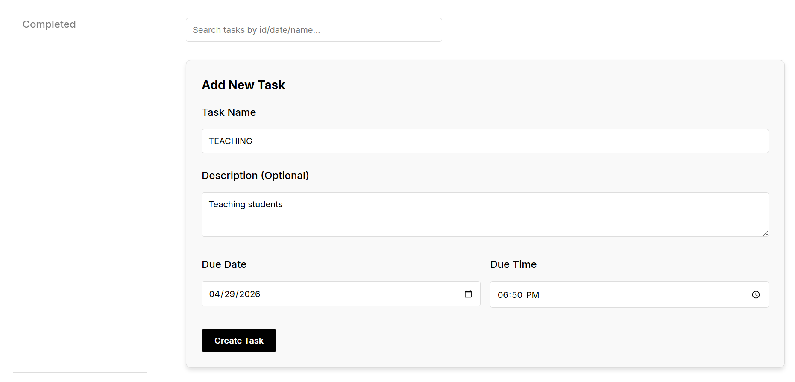
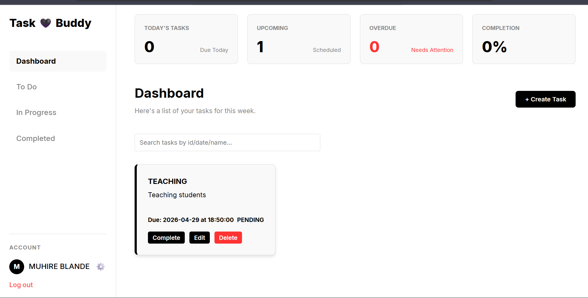
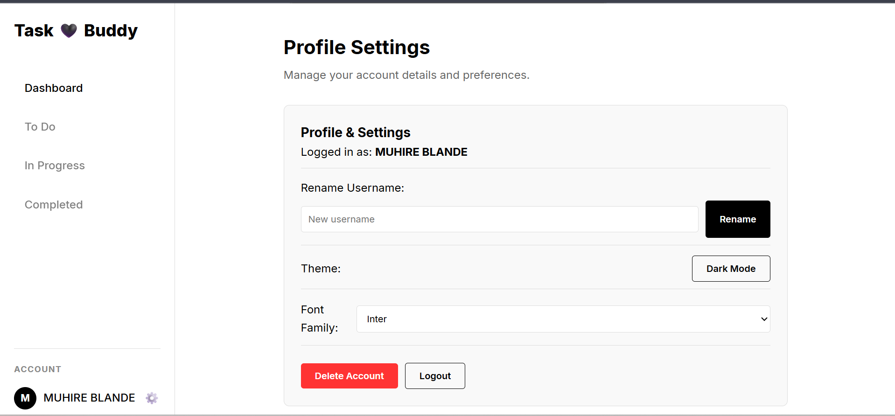
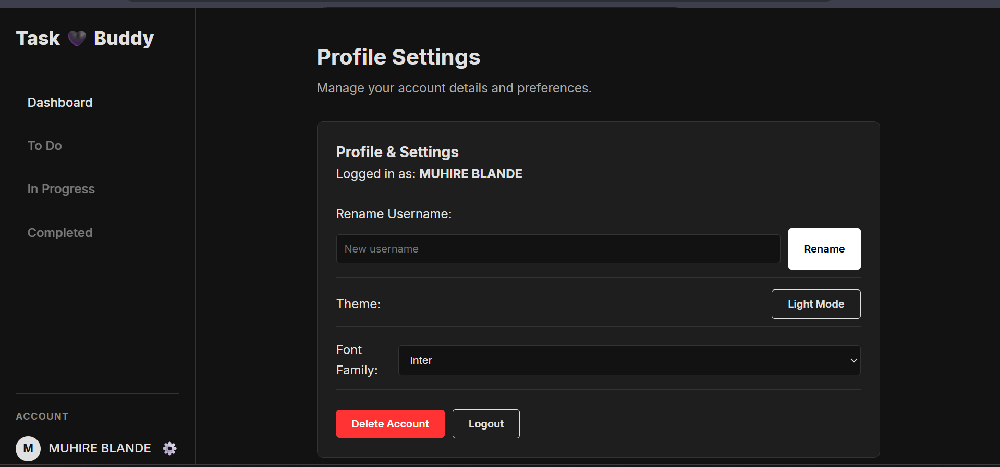
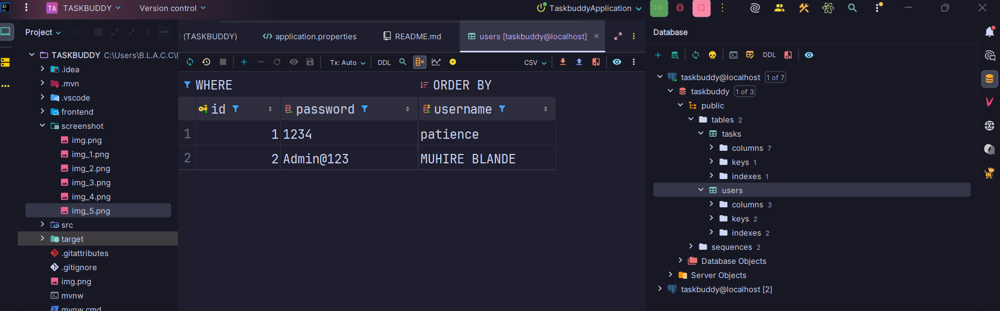
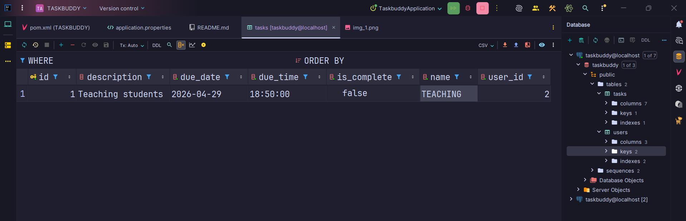
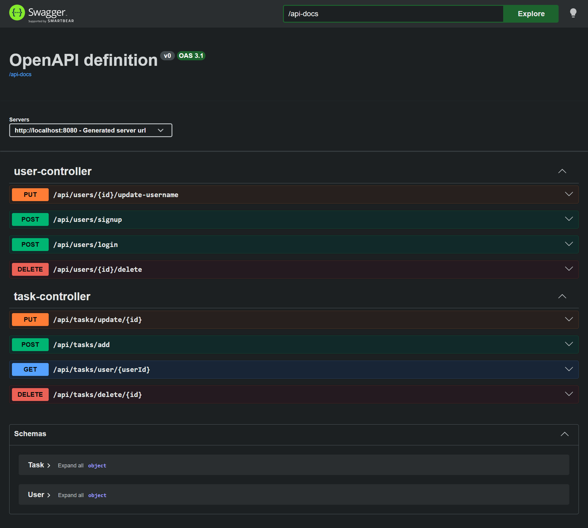

# TASKBUDDY - Task Management Application
AUTHOR:MUHIRE BLANDE 26295
## 📋 Table of Contents
- [Project Overview](#project-overview)
- [Features](#features)
- [Technology Stack](#technology-stack)
- [Architecture](#architecture)
- [Installation & Setup](#installation--setup)
- [API Documentation](#api-documentation)
- [Frontend Structure](#frontend-structure)
- [Backend Structure](#backend-structure)
- [Database Schema](#database-schema)
- [Screenshots](#screenshots)
- [Development](#development)
- [Testing](#testing)
- [Deployment](#deployment)
- [Contributing](#contributing)
- [License](#license)

## 📖 Project Overview

TASKBUDDY is a full-stack task management application that allows users to create, manage, and track their daily tasks. Built with Spring Boot 4.0.5 for the backend and Vue.js 3 for the frontend, it provides a clean and intuitive interface for personal task management.

### Key Capabilities
- User authentication (signup/login)
- Task creation with due dates and times
- Task search and filtering
- Automatic task completion based on due dates
- User profile management
- Responsive design with dark/light theme support

## ✨ Features

### User Management
- **User Registration**: Create new accounts with unique usernames
- **User Authentication**: Secure login system
- **Profile Management**: Update username and manage account settings
- **Account Deletion**: Remove user accounts and associated data

### Task Management
- **Create Tasks**: Add tasks with name, description, due date, and time
- **View Tasks**: Display all tasks for the logged-in user
- **Update Tasks**: Modify existing task details
- **Delete Tasks**: Remove tasks from the system
- **Search Tasks**: Find tasks by ID, name, or due date
- **Auto-completion**: Tasks automatically marked as complete when past due

### UI/UX Features
- **Responsive Design**: Works on desktop and mobile devices
- **Theme Support**: Light and dark mode options
- **Font Customization**: User-selectable fonts
- **Real-time Updates**: Immediate feedback on actions

## 🛠 Technology Stack

### Backend
- **Framework**: Spring Boot 4.0.5
- **Language**: Java 21
- **Database**: PostgreSQL
- **ORM**: Spring Data JPA / Hibernate
- **Validation**: Jakarta Bean Validation
- **API Documentation**: SpringDoc OpenAPI (Swagger UI)
- **Build Tool**: Maven

### Frontend
- **Framework**: Vue.js 3 (Composition API)
- **Routing**: Vue Router 5
- **Build Tool**: Vite
- **Styling**: CSS with CSS Variables

## 🏗 Architecture

TASKBUDDY follows a layered architecture pattern:

```
┌─────────────────────────────────────────┐
│              Frontend (Vue.js)          │
├─────────────────────────────────────────┤
│              REST API Layer             │
├─────────────────────────────────────────┤
│           Service Layer                 │
├─────────────────────────────────────────┤
│          Repository Layer               │
├─────────────────────────────────────────┤
│          Database (PostgreSQL)          │
└─────────────────────────────────────────┘
```

### Backend Layers
1. **Controller Layer**: Handles HTTP requests and responses
2. **Service Layer**: Contains business logic
3. **Repository Layer**: Data access with Spring Data JPA
4. **Model Layer**: Entity definitions

### Frontend Components
- **Views**: Page-level components (Login, Dashboard, etc.)
- **Components**: Reusable UI components (TaskForm, TaskList, etc.)
- **Router**: Client-side routing with authentication guards

## 🚀 Installation & Setup

### Prerequisites
- Java 21 or higher
- PostgreSQL 12 or higher
- Node.js 18 or higher
- Maven 3.8+

### Database Setup
1. Install and start PostgreSQL
2. Create a database named `taskbuddy`:
   ```sql
   CREATE DATABASE taskbuddy;
   ```
3. Update database credentials in `src/main/resources/application.properties` if needed

### Backend Setup
```bash
# Clone the repository
git clone <repository-url>
cd TASKBUDDY

# Build the project
mvn clean install

# Run the Spring Boot application
mvn spring-boot:run
```

The backend will start on `http://localhost:8080`

### Frontend Setup
```bash
# Navigate to frontend directory
cd frontend

# Install dependencies
npm install

# Run development server
npm run dev
```

The frontend will start on `http://localhost:5173`

## 📡 API Documentation

### Base URL
```
http://localhost:8080/api
```

### User Endpoints

#### Register User
```http
POST /api/users/signup
Content-Type: application/json

{
  "username": "string (min 3 chars)",
  "password": "string (min 4 chars)"
}
```

#### Login User
```http
POST /api/users/login
Content-Type: application/json

{
  "username": "string",
  "password": "string"
}
```

#### Update Username
```http
PUT /api/users/{id}/update-username
Content-Type: application/json

{
  "username": "string"
}
```

#### Delete Account
```http
DELETE /api/users/{id}/delete
```

### Task Endpoints

#### Create Task
```http
POST /api/tasks/add
Content-Type: application/json

{
  "name": "string (required)",
  "description": "string",
  "dueDate": "YYYY-MM-DD (required)",
  "dueTime": "HH:MM:SS (required)",
  "userId": "long (required)",
  "isComplete": "boolean"
}
```

#### Get User Tasks
```http
GET /api/tasks/user/{userId}?query=searchTerm
```

#### Update Task
```http
PUT /api/tasks/update/{id}
Content-Type: application/json

{
  "name": "string",
  "description": "string",
  "dueDate": "YYYY-MM-DD",
  "dueTime": "HH:MM:SS",
  "isComplete": "boolean",
  "userId": "long"
}
```

#### Delete Task
```http
DELETE /api/tasks/delete/{id}
```

### Swagger UI
Access interactive API documentation at:
```
http://localhost:8080/swagger-ui.html
```

## 🎨 Frontend Structure

```
frontend/
├── src/
│   ├── assets/           # Static assets (images, icons)
│   ├── components/       # Reusable Vue components
│   │   ├── MainLayout.vue
│   │   ├── ProfileSection.vue
│   │   ├── TaskForm.vue
│   │   └── TaskList.vue
│   ├── router/
│   │   └── index.js      # Vue Router configuration
│   ├── views/            # Page components
│   │   ├── DashboardPage.vue
│   │   ├── LandingPage.vue
│   │   ├── LoginPage.vue
│   │   ├── NotFoundPage.vue
│   │   ├── ProfileSettingsPage.vue
│   │   └── SignupPage.vue
│   ├── App.vue           # Root component
│   ├── main.js           # Application entry point
│   └── style.css         # Global styles
├── public/               # Public assets
├── index.html            # HTML template
├── package.json          # Dependencies and scripts
└── vite.config.js        # Vite configuration
```

### Key Frontend Features
- **Route Guards**: Authentication checks before accessing protected routes
- **Local Storage**: Stores user session and preferences
- **Theme Management**: CSS variables for easy theming
- **Component-Based**: Modular and reusable components

## 🔧 Backend Structure

```
src/main/java/com/blacc/taskbuddy/
├── TaskbuddyApplication.java  # Main application class
├── controller/
│   ├── TaskController.java    # Task REST endpoints
│   └── UserController.java    # User REST endpoints
├── model/
│   ├── Task.java              # Task entity
│   └── User.java              # User entity
├── repository/
│   ├── TaskRepository.java    # Task data access
│   └── UserRepository.java    # User data access
└── service/
    ├── TaskService.java       # Task business logic
    └── UserService.java       # User business logic
```

### Entity Models

#### User Entity
```java
- id: Long (Primary Key, Auto-generated)
- username: String (Unique, Min 3 chars)
- password: String (Min 4 chars)
```

#### Task Entity
```java
- id: Long (Primary Key, Auto-generated)
- name: String (Required)
- description: String
- dueDate: LocalDate (Required)
- dueTime: LocalTime (Required)
- isComplete: boolean
- userId: Long (Foreign Key reference)
```

## 🗄 Database Schema

### Tables

#### users
```sql
CREATE TABLE users (
    id BIGSERIAL PRIMARY KEY,
    username VARCHAR(255) UNIQUE NOT NULL,
    password VARCHAR(255) NOT NULL
);
```

#### tasks
```sql
CREATE TABLE tasks (
    id BIGSERIAL PRIMARY KEY,
    name VARCHAR(255) NOT NULL,
    description TEXT,
    due_date DATE NOT NULL,
    due_time TIME NOT NULL,
    is_complete BOOLEAN DEFAULT FALSE,
    user_id BIGINT NOT NULL,
    FOREIGN KEY (user_id) REFERENCES users(id) ON DELETE CASCADE
);
```

### JPA Configuration
- **DDL Auto**: update (automatically creates/updates tables)
- **Show SQL**: enabled for development
- **Dialect**: PostgreSQL

## 📸 Screenshots

> **Add your screenshots here**

### Landing Page

*Description: The main landing page of TASKBUDDY*

### Login Page

*Description: User authentication login form*

### Signup Page

*Description: New user registration form*

### Dashboard

*Description: Main task management dashboard*

### Task Creation


*Description: Form for creating new tasks*

### Profile Settings

*Description: User profile management page*

### Dark Theme

*Description: Application in dark mode*

Table users

Table tasks

SWAGGER API

---


## 💻 Development

### Running in Development Mode

#### Backend
```bash
mvn spring-boot:run
```

#### Frontend
```bash
cd frontend
npm run dev
```

### Code Style
- **Backend**: Follow Java naming conventions and Spring Boot best practices
- **Frontend**: Use Vue 3 Composition API with `<script setup>` syntax

### Environment Variables
Currently, configuration is managed through:
- `src/main/resources/application.properties` (Backend)
- `frontend/.env` (Frontend - if needed)

## 🧪 Testing

### Backend Tests
```bash
# Run all tests
mvn test

# Run specific test class
mvn test -Dtest=TaskbuddyApplicationTests
```

### Frontend Tests
```bash
cd frontend
# Add testing framework as needed
```

## 🚢 Deployment

### Build for Production

#### Backend
```bash
# Create executable JAR
mvn clean package

# Run the JAR
java -jar target/TASKBUDDY-0.0.1-SNAPSHOT.jar
```

#### Frontend
```bash
cd frontend
npm run build
```

The built frontend files will be in `frontend/dist/`

### Production Considerations
- Use environment variables for database credentials
- Enable HTTPS
- Configure CORS for specific domains
- Use a production-ready PostgreSQL instance
- Consider adding authentication tokens (JWT)
- Implement password encryption (BCrypt)


---

**Built with ❤️ using Spring Boot & Vue.js**
